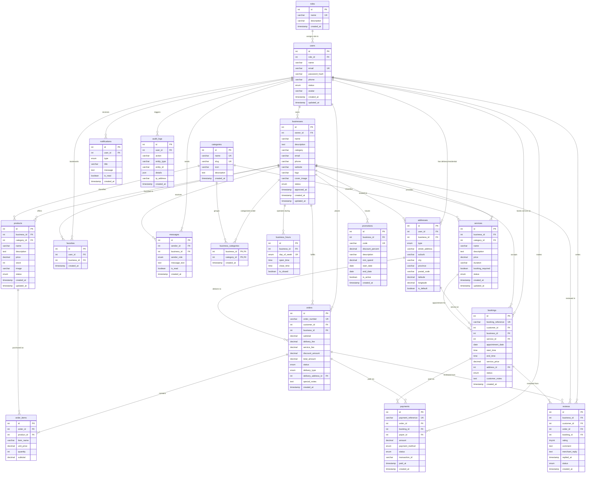

# LocalBiz South Africa — Relational Database Architecture & ERD Specification

This document provides the complete architectural specification, entity-relationship diagrams (ERD), data dictionary, state machines, and indexing design for the **LocalBiz** relational database targeting **MySQL 8.0+** and **MariaDB 10.5+**.

---

## 1. Entity-Relationship Diagram (ERD)

The diagram below illustrates the 19 core entities in the LocalBiz marketplace and their relational cardinality.



---

## 2. Table-by-Table Data Dictionary

### 2.1 `roles`
System access control levels.

| Column | Type | Constraints | Default | Description |
|---|---|---|---|---|
| `id` | `INT UNSIGNED` | `PRIMARY KEY AUTO_INCREMENT` | — | Role unique identifier |
| `name` | `VARCHAR(50)` | `NOT NULL UNIQUE` | — | Role name (`ADMIN`, `BUSINESS`, `CONSUMER`) |
| `description` | `VARCHAR(255)` | `NULL` | `NULL` | Human-readable permission explanation |
| `created_at` | `TIMESTAMP` | `NOT NULL` | `CURRENT_TIMESTAMP` | Row creation timestamp |
| `updated_at` | `TIMESTAMP` | `NOT NULL` | `CURRENT_TIMESTAMP ON UPDATE CURRENT_TIMESTAMP` | Last updated timestamp |

### 2.2 `users`
System accounts for shoppers, sellers, and administrators.

| Column | Type | Constraints | Default | Description |
|---|---|---|---|---|
| `id` | `INT UNSIGNED` | `PRIMARY KEY AUTO_INCREMENT` | — | User unique identifier |
| `role_id` | `INT UNSIGNED` | `NOT NULL FK -> roles(id)` | — | User permission role |
| `name` | `VARCHAR(100)` | `NOT NULL` | — | Full personal or legal entity name |
| `email` | `VARCHAR(255)` | `NOT NULL UNIQUE` | — | Verified electronic mail address |
| `password_hash` | `VARCHAR(255)` | `NOT NULL` | — | Bcrypt password hash ($2b$10$) |
| `phone` | `VARCHAR(30)` | `NULL` | `NULL` | Primary South African mobile (+27) |
| `status` | `ENUM` | `NOT NULL` | `'ACTIVE'` | `'ACTIVE'`, `'SUSPENDED'`, `'PENDING_VERIFICATION'` |
| `avatar` | `VARCHAR(500)` | `NULL` | `NULL` | Avatar or profile image URL |
| `created_at` | `TIMESTAMP` | `NOT NULL` | `CURRENT_TIMESTAMP` | Registration timestamp |
| `updated_at` | `TIMESTAMP` | `NOT NULL` | `CURRENT_TIMESTAMP ON UPDATE CURRENT_TIMESTAMP` | Last modification timestamp |

### 2.3 `businesses`
Vendor storefronts, KYC standing, contact, and branding.

| Column | Type | Constraints | Default | Description |
|---|---|---|---|---|
| `id` | `INT UNSIGNED` | `PRIMARY KEY AUTO_INCREMENT` | — | Business unique identifier |
| `owner_id` | `INT UNSIGNED` | `NOT NULL FK -> users(id)` | — | User account owning the store |
| `name` | `VARCHAR(150)` | `NOT NULL` | — | Registered trading name |
| `description` | `TEXT` | `NULL` | `NULL` | Store overview and trade scope |
| `category` | `VARCHAR(100)` | `NOT NULL` | — | Primary industry classification |
| `email` | `VARCHAR(255)` | `NOT NULL` | — | Store public customer inquiries email |
| `phone` | `VARCHAR(30)` | `NOT NULL` | — | WhatsApp and dispatch contact number |
| `website` | `VARCHAR(255)` | `NULL` | `NULL` | External website or social link |
| `logo` | `VARCHAR(500)` | `NULL` | `NULL` | Brand icon URL |
| `cover_image` | `VARCHAR(500)` | `NULL` | `NULL` | Storefront banner URL |
| `status` | `ENUM` | `NOT NULL` | `'PENDING'` | `'PENDING'`, `'APPROVED'`, `'REJECTED'`, `'SUSPENDED'` |
| `approved_at` | `TIMESTAMP` | `NULL` | `NULL` | Admin verification approval timestamp |
| `created_at` | `TIMESTAMP` | `NOT NULL` | `CURRENT_TIMESTAMP` | Registration date |
| `updated_at` | `TIMESTAMP` | `NOT NULL` | `CURRENT_TIMESTAMP ON UPDATE CURRENT_TIMESTAMP` | Last update date |

### 2.4 `categories`
Marketplace taxonomy and browse filters.

| Column | Type | Constraints | Default | Description |
|---|---|---|---|---|
| `id` | `INT UNSIGNED` | `PRIMARY KEY AUTO_INCREMENT` | — | Category unique identifier |
| `name` | `VARCHAR(100)` | `NOT NULL UNIQUE` | — | Category display title |
| `slug` | `VARCHAR(120)` | `NOT NULL UNIQUE` | — | URL-friendly slug (`beauty-cosmetics`) |
| `icon` | `VARCHAR(50)` | `NULL` | `'Tag'` | Lucide icon identifier |
| `description` | `TEXT` | `NULL` | `NULL` | Suburb category scope |
| `created_at` | `TIMESTAMP` | `NOT NULL` | `CURRENT_TIMESTAMP` | Creation timestamp |
| `updated_at` | `TIMESTAMP` | `NOT NULL` | `CURRENT_TIMESTAMP ON UPDATE CURRENT_TIMESTAMP` | Update timestamp |

### 2.5 `business_categories`
Junction table facilitating multiple categories per business.

| Column | Type | Constraints | Default | Description |
|---|---|---|---|---|
| `business_id` | `INT UNSIGNED` | `PRIMARY KEY (1/2), FK -> businesses(id) ON DELETE CASCADE` | — | Associated business |
| `category_id` | `INT UNSIGNED` | `PRIMARY KEY (2/2), FK -> categories(id) ON DELETE RESTRICT` | — | Associated category |
| `created_at` | `TIMESTAMP` | `NOT NULL` | `CURRENT_TIMESTAMP` | Association timestamp |

### 2.6 `addresses`
Physical premises for businesses and delivery destinations for consumers.

| Column | Type | Constraints | Default | Description |
|---|---|---|---|---|
| `id` | `INT UNSIGNED` | `PRIMARY KEY AUTO_INCREMENT` | — | Address unique identifier |
| `user_id` | `INT UNSIGNED` | `NULL FK -> users(id) ON DELETE CASCADE` | `NULL` | Consumer owner |
| `business_id` | `INT UNSIGNED` | `NULL FK -> businesses(id) ON DELETE CASCADE` | `NULL` | Business owner |
| `type` | `ENUM` | `NOT NULL` | `'RESIDENTIAL'` | `'RESIDENTIAL'`, `'BUSINESS'`, `'DELIVERY'`, `'BILLING'` |
| `street_address` | `VARCHAR(255)` | `NOT NULL` | — | Street number and avenue name |
| `suburb` | `VARCHAR(100)` | `NOT NULL` | — | Suburb (e.g. Alberton North, Meyersdal) |
| `city` | `VARCHAR(100)` | `NOT NULL` | `'Johannesburg'` | Municipality / City |
| `province` | `VARCHAR(100)` | `NOT NULL` | `'Gauteng'` | Province |
| `postal_code` | `VARCHAR(20)` | `NOT NULL` | — | South African postal code |
| `latitude` | `DECIMAL(10,8)` | `NULL` | `NULL` | GPS Latitude for proximity queries |
| `longitude` | `DECIMAL(11,8)` | `NULL` | `NULL` | GPS Longitude for proximity queries |
| `is_default` | `BOOLEAN` | `NOT NULL` | `0` | Default selection flag |

### 2.7 `business_hours`
Store operating schedule.

| Column | Type | Constraints | Default | Description |
|---|---|---|---|---|
| `id` | `INT UNSIGNED` | `PRIMARY KEY AUTO_INCREMENT` | — | Hour record unique identifier |
| `business_id` | `INT UNSIGNED` | `NOT NULL FK -> businesses(id) ON DELETE CASCADE` | — | Associated store |
| `day_of_week` | `ENUM` | `NOT NULL` | — | `'MONDAY'` through `'SUNDAY'` |
| `open_time` | `TIME` | `NULL` | `NULL` | Opening time (HH:MM:SS) |
| `close_time` | `TIME` | `NULL` | `NULL` | Closing time (HH:MM:SS) |
| `is_closed` | `BOOLEAN` | `NOT NULL` | `0` | Full-day closed indicator |

### 2.8 `products`
Physical retail goods and inventory.

| Column | Type | Constraints | Default | Description |
|---|---|---|---|---|
| `id` | `INT UNSIGNED` | `PRIMARY KEY AUTO_INCREMENT` | — | Product unique identifier |
| `business_id` | `INT UNSIGNED` | `NOT NULL FK -> businesses(id) ON DELETE CASCADE` | — | Selling merchant |
| `category_id` | `INT UNSIGNED` | `NOT NULL FK -> categories(id) ON DELETE RESTRICT` | — | Product category |
| `name` | `VARCHAR(150)` | `NOT NULL` | — | Product listing title |
| `description` | `TEXT` | `NULL` | `NULL` | Product specs and details |
| `price` | `DECIMAL(10,2)` | `NOT NULL` | — | Price in South African Rands (ZAR) |
| `stock` | `INT` | `NOT NULL` | `0` | Units currently available in store |
| `image` | `VARCHAR(500)` | `NULL` | `NULL` | Product photo URL |
| `status` | `ENUM` | `NOT NULL` | `'ACTIVE'` | `'ACTIVE'`, `'OUT_OF_STOCK'`, `'ARCHIVED'`, `'DRAFT'` |

### 2.9 `services`
Professional trade, repair, and bookable services.

| Column | Type | Constraints | Default | Description |
|---|---|---|---|---|
| `id` | `INT UNSIGNED` | `PRIMARY KEY AUTO_INCREMENT` | — | Service unique identifier |
| `business_id` | `INT UNSIGNED` | `NOT NULL FK -> businesses(id) ON DELETE CASCADE` | — | Service merchant |
| `category_id` | `INT UNSIGNED` | `NOT NULL FK -> categories(id) ON DELETE RESTRICT` | — | Service category |
| `name` | `VARCHAR(150)` | `NOT NULL` | — | Service title |
| `description` | `TEXT` | `NULL` | `NULL` | Scope of work and deliverables |
| `price` | `DECIMAL(10,2)` | `NOT NULL` | — | Standard rate or call-out fee (ZAR) |
| `duration` | `VARCHAR(50)` | `NOT NULL` | — | Estimated job duration (e.g. '1 - 2 hours') |
| `booking_required` | `BOOLEAN` | `NOT NULL` | `1` | Requires calendar reservation |
| `status` | `ENUM` | `NOT NULL` | `'ACTIVE'` | `'ACTIVE'`, `'UNAVAILABLE'`, `'ARCHIVED'` |

### 2.10 `orders`
Consumer product purchases and delivery routing.

| Column | Type | Constraints | Default | Description |
|---|---|---|---|---|
| `id` | `INT UNSIGNED` | `PRIMARY KEY AUTO_INCREMENT` | — | Order unique identifier |
| `order_number` | `VARCHAR(30)` | `NOT NULL UNIQUE` | — | Customer reference (`LBZ-2026-1001`) |
| `customer_id` | `INT UNSIGNED` | `NOT NULL FK -> users(id) ON DELETE RESTRICT` | — | Purchasing user |
| `business_id` | `INT UNSIGNED` | `NOT NULL FK -> businesses(id) ON DELETE RESTRICT` | — | Merchant fulfilling the order |
| `subtotal` | `DECIMAL(10,2)` | `NOT NULL` | — | Sum of line items |
| `delivery_fee` | `DECIMAL(10,2)` | `NOT NULL` | `0.00` | Courier delivery charge |
| `service_fee` | `DECIMAL(10,2)` | `NOT NULL` | `5.00` | Platform transaction fee |
| `discount_amount` | `DECIMAL(10,2)` | `NOT NULL` | `0.00` | Promo coupon reduction |
| `total_amount` | `DECIMAL(10,2)` | `NOT NULL` | — | Final charged total |
| `status` | `ENUM` | `NOT NULL` | `'PENDING'` | 9-stage fulfillment lifecycle |
| `delivery_type` | `ENUM` | `NOT NULL` | `'DELIVERY'` | `'DELIVERY'`, `'COLLECTION'` |
| `delivery_address_id` | `INT UNSIGNED` | `NULL FK -> addresses(id) ON DELETE SET NULL` | `NULL` | Destination address |
| `special_notes` | `TEXT` | `NULL` | `NULL` | Delivery instructions (gate codes, etc.) |

### 2.11 `order_items`
Snapshot record of purchased items.

| Column | Type | Constraints | Default | Description |
|---|---|---|---|---|
| `id` | `INT UNSIGNED` | `PRIMARY KEY AUTO_INCREMENT` | — | Item unique identifier |
| `order_id` | `INT UNSIGNED` | `NOT NULL FK -> orders(id) ON DELETE CASCADE` | — | Parent order |
| `product_id` | `INT UNSIGNED` | `NULL FK -> products(id) ON DELETE SET NULL` | `NULL` | Catalog product reference |
| `item_name` | `VARCHAR(150)` | `NOT NULL` | — | Product name snapshot at checkout |
| `unit_price` | `DECIMAL(10,2)` | `NOT NULL` | — | Price snapshot at checkout |
| `quantity` | `INT UNSIGNED` | `NOT NULL` | `1` | Units ordered |
| `subtotal` | `DECIMAL(10,2)` | `NOT NULL` | — | `unit_price * quantity` |

### 2.12 `bookings`
Trade, repair, and appointment scheduling.

| Column | Type | Constraints | Default | Description |
|---|---|---|---|---|
| `id` | `INT UNSIGNED` | `PRIMARY KEY AUTO_INCREMENT` | — | Booking unique identifier |
| `booking_reference` | `VARCHAR(30)` | `NOT NULL UNIQUE` | — | Reference code (`BK-2026-501`) |
| `customer_id` | `INT UNSIGNED` | `NOT NULL FK -> users(id) ON DELETE RESTRICT` | — | Client booking the service |
| `business_id` | `INT UNSIGNED` | `NOT NULL FK -> businesses(id) ON DELETE RESTRICT` | — | Service provider |
| `service_id` | `INT UNSIGNED` | `NOT NULL FK -> services(id) ON DELETE RESTRICT` | — | Booked trade service |
| `appointment_date` | `DATE` | `NOT NULL` | — | Scheduled date (YYYY-MM-DD) |
| `start_time` | `TIME` | `NOT NULL` | — | Slot start time |
| `end_time` | `TIME` | `NULL` | `NULL` | Slot end time |
| `service_price` | `DECIMAL(10,2)` | `NOT NULL` | — | Agreed service rate |
| `address_id` | `INT UNSIGNED` | `NULL FK -> addresses(id) ON DELETE SET NULL` | `NULL` | Job call-out location |
| `status` | `ENUM` | `NOT NULL` | `'PENDING'` | 8-stage appointment lifecycle |
| `customer_notes` | `TEXT` | `NULL` | `NULL` | Problem description or special requests |

### 2.13 `payments`
Financial transaction ledger for orders and bookings.

| Column | Type | Constraints | Default | Description |
|---|---|---|---|---|
| `id` | `INT UNSIGNED` | `PRIMARY KEY AUTO_INCREMENT` | — | Payment unique identifier |
| `payment_reference` | `VARCHAR(50)` | `NOT NULL UNIQUE` | — | Financial tracking reference (`PAY-2026-7001`) |
| `order_id` | `INT UNSIGNED` | `NULL FK -> orders(id) ON DELETE SET NULL` | `NULL` | Paid order |
| `booking_id` | `INT UNSIGNED` | `NULL FK -> bookings(id) ON DELETE SET NULL` | `NULL` | Paid booking |
| `payer_id` | `INT UNSIGNED` | `NOT NULL FK -> users(id) ON DELETE RESTRICT` | — | Paying customer |
| `amount` | `DECIMAL(10,2)` | `NOT NULL` | — | Amount paid in ZAR |
| `payment_method` | `ENUM` | `NOT NULL` | `'CARD'` | `'CARD'`, `'CASH_ON_DELIVERY'`, `'EFT'`, `'POS_TERMINAL'`, `'WALLET'` |
| `status` | `ENUM` | `NOT NULL` | `'PENDING'` | 6-stage payment lifecycle |
| `transaction_id` | `VARCHAR(100)` | `NULL` | `NULL` | External gateway transaction hash |
| `paid_at` | `TIMESTAMP` | `NULL` | `NULL` | Gateway clearance timestamp |

### 2.14 `reviews`
Verified buyer feedback and merchant replies.

| Column | Type | Constraints | Default | Description |
|---|---|---|---|---|
| `id` | `INT UNSIGNED` | `PRIMARY KEY AUTO_INCREMENT` | — | Review unique identifier |
| `business_id` | `INT UNSIGNED` | `NOT NULL FK -> businesses(id) ON DELETE CASCADE` | — | Reviewed business |
| `customer_id` | `INT UNSIGNED` | `NOT NULL FK -> users(id) ON DELETE CASCADE` | — | Reviewing consumer |
| `order_id` | `INT UNSIGNED` | `NULL FK -> orders(id) ON DELETE SET NULL` | `NULL` | Associated verified purchase |
| `booking_id` | `INT UNSIGNED` | `NULL FK -> bookings(id) ON DELETE SET NULL` | `NULL` | Associated verified appointment |
| `rating` | `TINYINT UNSIGNED` | `NOT NULL CHECK (rating >= 1 AND rating <= 5)` | — | Star score (1 to 5) |
| `comment` | `TEXT` | `NULL` | `NULL` | Customer feedback text |
| `merchant_reply` | `TEXT` | `NULL` | `NULL` | Public response from store owner |
| `replied_at` | `TIMESTAMP` | `NULL` | `NULL` | Response timestamp |
| `status` | `ENUM` | `NOT NULL` | `'APPROVED'` | `'APPROVED'`, `'PENDING'`, `'FLAGGED'`, `'HIDDEN'` |

### 2.15 `notifications`
Real-time transactional and security alerts.

| Column | Type | Constraints | Default | Description |
|---|---|---|---|---|
| `id` | `INT UNSIGNED` | `PRIMARY KEY AUTO_INCREMENT` | — | Notification identifier |
| `user_id` | `INT UNSIGNED` | `NOT NULL FK -> users(id) ON DELETE CASCADE` | — | Recipient user |
| `type` | `ENUM` | `NOT NULL` | — | `'ORDER'`, `'BOOKING'`, `'PAYMENT'`, `'PROMOTION'`, `'SYSTEM'`, `'APPROVAL'` |
| `title` | `VARCHAR(150)` | `NOT NULL` | — | Header summary |
| `message` | `TEXT` | `NOT NULL` | — | Full notification body |
| `is_read` | `BOOLEAN` | `NOT NULL` | `0` | Unread / read status |

### 2.16 `favorites`
Consumer bookmarked businesses.

| Column | Type | Constraints | Default | Description |
|---|---|---|---|---|
| `id` | `INT UNSIGNED` | `PRIMARY KEY AUTO_INCREMENT` | — | Favorite record identifier |
| `user_id` | `INT UNSIGNED` | `NOT NULL FK -> users(id) ON DELETE CASCADE` | — | Consumer who saved |
| `business_id` | `INT UNSIGNED` | `NOT NULL FK -> businesses(id) ON DELETE CASCADE` | — | Bookmarked merchant |
| `UNIQUE KEY` | `uq_user_business_favorite` | `(`user_id`, `business_id`)` | — | Prevents duplicate saves |

### 2.17 `promotions`
Discount vouchers and promotional campaigns.

| Column | Type | Constraints | Default | Description |
|---|---|---|---|---|
| `id` | `INT UNSIGNED` | `PRIMARY KEY AUTO_INCREMENT` | — | Promotion identifier |
| `business_id` | `INT UNSIGNED` | `NOT NULL FK -> businesses(id) ON DELETE CASCADE` | — | Sponsoring merchant |
| `code` | `VARCHAR(50)` | `NOT NULL UNIQUE` | — | Coupon code (e.g. `ALBERTON10`) |
| `discount_percent` | `DECIMAL(5,2)` | `NOT NULL` | — | Percentage off (e.g. 10.00%) |
| `description` | `VARCHAR(255)` | `NULL` | `NULL` | Promotion conditions |
| `min_spend` | `DECIMAL(10,2)` | `NOT NULL` | `0.00` | Minimum cart subtotal in ZAR |
| `start_date` | `DATE` | `NOT NULL` | — | Valid from |
| `end_date` | `DATE` | `NULL` | `NULL` | Valid until |
| `is_active` | `BOOLEAN` | `NOT NULL` | `1` | Enable/disable toggle |

### 2.18 `messages`
Direct messaging between consumers and store owners.

| Column | Type | Constraints | Default | Description |
|---|---|---|---|---|
| `id` | `INT UNSIGNED` | `PRIMARY KEY AUTO_INCREMENT` | — | Message identifier |
| `sender_id` | `INT UNSIGNED` | `NOT NULL FK -> users(id) ON DELETE CASCADE` | — | Message sender |
| `business_id` | `INT UNSIGNED` | `NOT NULL FK -> businesses(id) ON DELETE CASCADE` | — | Store conversation thread |
| `sender_role` | `ENUM` | `NOT NULL` | `'CONSUMER'` | `'CONSUMER'`, `'BUSINESS'` |
| `message_text` | `TEXT` | `NOT NULL` | — | Chat content |
| `is_read` | `BOOLEAN` | `NOT NULL` | `0` | Seen indicator |

### 2.19 `audit_logs`
Platform security events and KYC governance logs.

| Column | Type | Constraints | Default | Description |
|---|---|---|---|---|
| `id` | `INT UNSIGNED` | `PRIMARY KEY AUTO_INCREMENT` | — | Log entry identifier |
| `user_id` | `INT UNSIGNED` | `NULL FK -> users(id) ON DELETE SET NULL` | `NULL` | Actor performing action |
| `action` | `VARCHAR(100)` | `NOT NULL` | — | Event code (`KYC_APPROVED`, `SETTINGS_UPDATE`) |
| `entity_type` | `VARCHAR(50)` | `NOT NULL` | — | Target entity (`BUSINESS`, `ORDER`, `USER`) |
| `entity_id` | `VARCHAR(50)` | `NULL` | `NULL` | Primary key of modified entity |
| `details` | `JSON` | `NULL` | `NULL` | Structured metadata snapshot |
| `ip_address` | `VARCHAR(45)` | `NULL` | `NULL` | Client IPv4 or IPv6 |

---

## 3. State Machine Lifecycles

### 3.1 Business KYC Lifecycle
```text
[ Registration ]
       │
       ▼
   ( PENDING ) ──────────► ( REJECTED )
       │
       ▼
   ( APPROVED ) ◄────────► ( SUSPENDED )
```

### 3.2 Order Fulfillment Lifecycle (9 Stages)
```text
[ Cart Checkout ]
       │
       ▼
   ( PENDING ) ──────────► ( REJECTED )
       │
       ├─────────────────► ( CANCELLED )
       ▼
   ( ACCEPTED )
       │
       ▼
  ( PROCESSING )
       │
       ▼
    ( READY )
       │
       ▼
( OUT_FOR_DELIVERY )
       │
       ▼
  ( DELIVERED )
       │
       ▼
  ( COMPLETED )
```

### 3.3 Service Booking Lifecycle (8 Stages)
```text
[ Client Call-Out Request ]
             │
             ▼
        ( PENDING ) ──────────► ( REJECTED )
             │
             ├────────────────► ( CANCELLED )
             ▼
        ( CONFIRMED ) ◄───────► ( RESCHEDULED )
             │
             ├────────────────► ( NO_SHOW )
             ▼
       ( IN_PROGRESS )
             │
             ▼
        ( COMPLETED )
```

### 3.4 Payment Processing Lifecycle (6 Stages)
```text
[ Payment Initiated ]
          │
          ▼
     ( PENDING ) ──────────► ( CANCELLED )
          │
          ▼
    ( PROCESSING ) ────────► ( FAILED )
          │
          ▼
      ( SUCCESS ) ─────────► ( REFUNDED )
```

---

## 4. Indexing & Query Optimization Strategy

| Index Name | Table | Columns | Type | Purpose |
|---|---|---|---|---|
| `uq_roles_name` | `roles` | `name` | UNIQUE | Enforces unique role names |
| `uq_users_email` | `users` | `email` | UNIQUE | Prevents duplicate user accounts |
| `idx_users_role_id` | `users` | `role_id` | B-TREE | Speeds up RBAC authorization lookups |
| `idx_businesses_owner_id` | `businesses` | `owner_id` | B-TREE | Instant seller profile lookup on merchant portal login |
| `idx_businesses_status` | `businesses` | `status` | B-TREE | Fast filtration of verified active storefronts |
| `idx_addresses_suburb` | `addresses` | `suburb` | B-TREE | Powers hyperlocal neighborhood filtering (Alberton, Meyersdal) |
| `uq_business_day` | `business_hours` | `business_id, day_of_week` | UNIQUE | Guarantees one schedule per weekday per store |
| `idx_products_business_id` | `products` | `business_id` | B-TREE | Catalog retrieval for individual storefronts |
| `idx_products_category_id` | `products` | `category_id` | B-TREE | Marketplace category feed filtering |
| `uq_orders_order_number` | `orders` | `order_number` | UNIQUE | Ensures order tracking code uniqueness |
| `idx_orders_customer_id` | `orders` | `customer_id` | B-TREE | Order history retrieval for consumer portal |
| `idx_orders_status` | `orders` | `status` | B-TREE | Active order pipeline filtering for dispatchers |
| `uq_bookings_reference` | `bookings` | `booking_reference` | UNIQUE | Ensures trade booking reference uniqueness |
| `idx_bookings_date` | `bookings` | `appointment_date` | B-TREE | Day-planner agenda queries for service trades |
| `uq_payments_reference` | `payments` | `payment_reference` | UNIQUE | Financial audit ledger integrity |
| `chk_reviews_rating` | `reviews` | `rating` | CHECK | Restricts rating to 1..5 range |
| `idx_notifications_user_read` | `notifications` | `user_id, is_read` | COMPOSITE | Unread badge counts and notification drawer queries |
| `uq_user_business_favorite` | `favorites` | `user_id, business_id` | UNIQUE | Prevents saving the same merchant multiple times |
| `uq_promotions_code` | `promotions` | `code` | UNIQUE | Fast promo code lookups at checkout |

---

## 5. Import Instructions (MySQL & MariaDB)

### Using the MySQL / MariaDB Command Line Client

```bash
# 1. Create the database
mysql -u root -p -e "CREATE DATABASE IF NOT EXISTS localbiz CHARACTER SET utf8mb4 COLLATE utf8mb4_unicode_ci;"

# 2. Import schema
mysql -u root -p localbiz < schema.sql

# 3. Import seed data
mysql -u root -p localbiz < seed.sql
```

### Using MySQL Workbench or phpMyAdmin
1. Create a new database named `localbiz` with `utf8mb4` encoding and `utf8mb4_unicode_ci` collation.
2. Open `schema.sql` in a SQL query tab and execute the script.
3. Open `seed.sql` in a SQL query tab and execute the script.

---

## 6. SQL Verification & Integrity Queries

```sql
-- 1. Verify all 19 tables exist
SELECT table_name, table_rows 
FROM information_schema.tables 
WHERE table_schema = 'localbiz' 
ORDER BY table_name;

-- 2. Verify KYC breakdown
SELECT status, COUNT(*) AS total_businesses 
FROM businesses 
GROUP BY status;

-- 3. Verify Order totals vs Line Item calculations
SELECT o.order_number, o.subtotal, SUM(oi.subtotal) AS calculated_lines_sum
FROM orders o
JOIN order_items oi ON o.id = oi.order_id
GROUP BY o.id, o.order_number, o.subtotal;

-- 4. Test duplicate favorite constraint (Must produce ERROR 1062)
INSERT INTO favorites (user_id, business_id) VALUES (2, 1);
```
